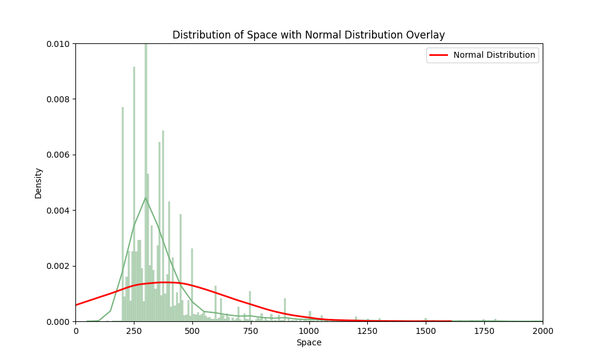

# Team Members
- albandari alshudukhi
- Hisham Altayieb
- Faris Alotaibi

# Introduction
The objective of this project is to perform an exploratory data analysis on a dataset about Riyadh Villas Aqar using Python packages such as use NumPy, pandas, matplotlib, seaborn, ,Plotly and Create an interactive dashboard **.

# Dataset Overview and Source.
The dataset we used https://www.kaggle.com/datasets/reemamuhammed/riyadh-villas-aqar

# This analysis process will contain the following questions:
1. Is there a relationship between the increase in house prices and space?

2.What is the average large houses sizes in Riyadh by neighbourhood?

3.What are the average prices in based on locations in Riyadh?

4.What is the average price for duplexes in each neighborhood?

5.Waht is the Average space of duplexes by neighborhood?

6.What is the Total Number of Apartments by Location?

7.Does the property age affect the price?

8.What is the average space by property age ?

Conclusions
We found a lot of observations, and based on the small size of the database, we could not identify many observations or dive deeper into the analyzes, but in general we noticed an increase in prices, a variety of types of real estate, and a decrease in the spaces offered, with the increase in the division of Riyadh into old areas and luxurious areas where the prices increase
